# Shopio
### E-Commerce webapp where a person can buy clothes.This webapp is built with Node.js, React.js, Express, MongoDB, Redux.
### Features
- React in frontend.
- Node provides the backend environment for this application.
- PayPal sandbox is used that provides virtual testing environment that simulates the live PayPal production environment.
- MongoDB is used to store all the data related to products and orders.
- Redux to manage application's state.

### Home page that has all the products.
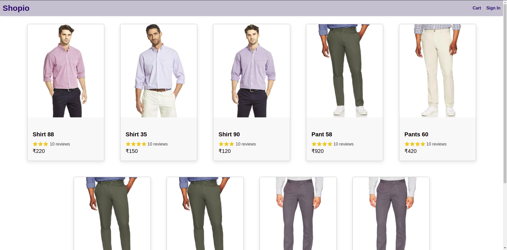
### Add to cart page.
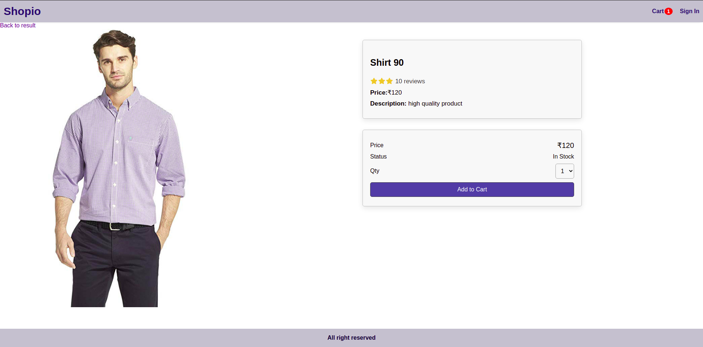
### Shopping cart page.
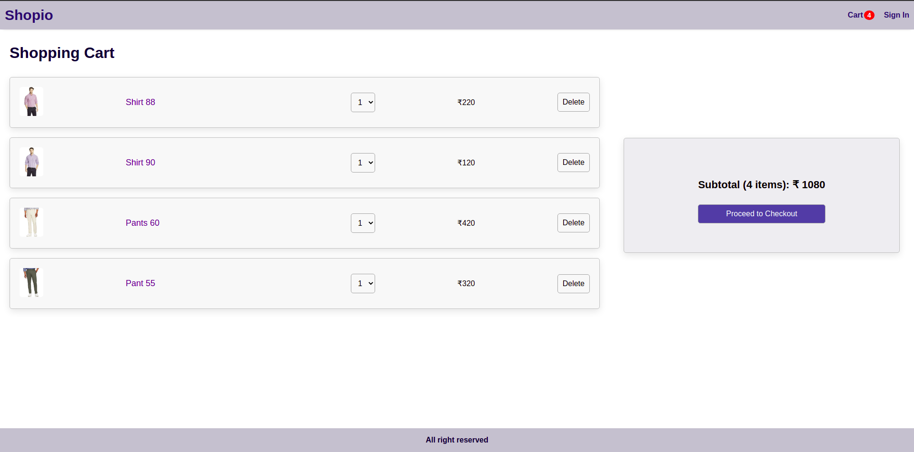
### Log in page.
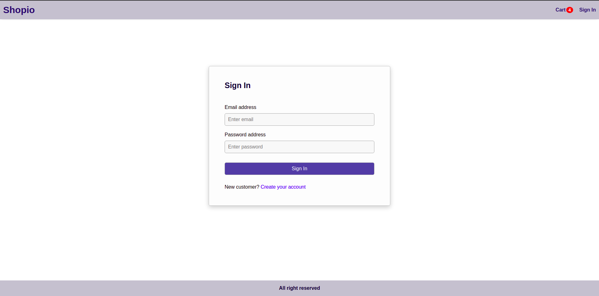
### Sign up page.
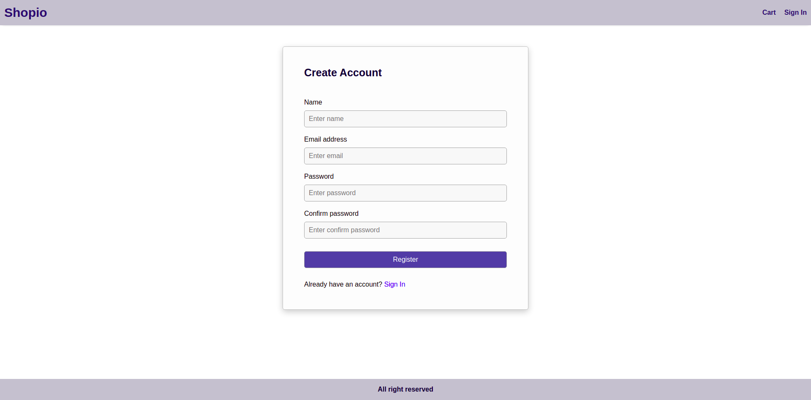
### Shipping Order page.
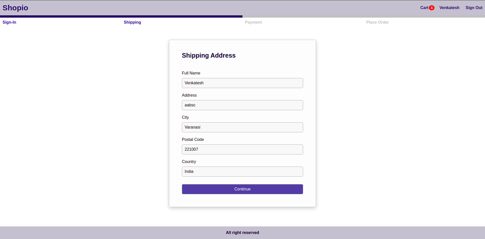
### Payment Method page
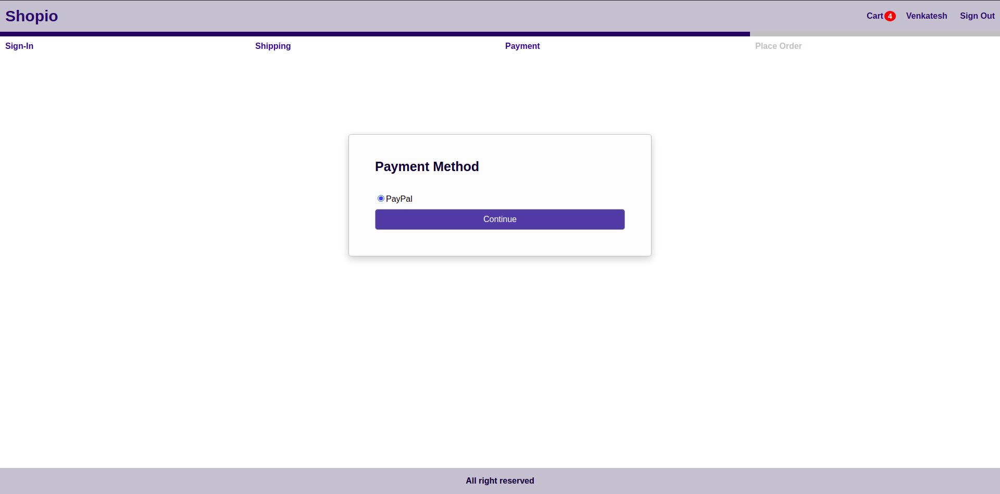
### Order summary page
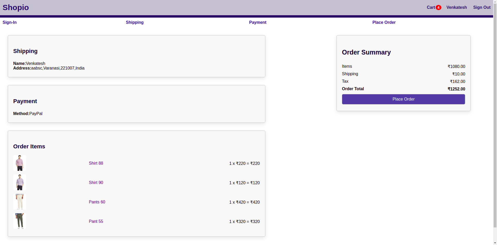
### Payment page
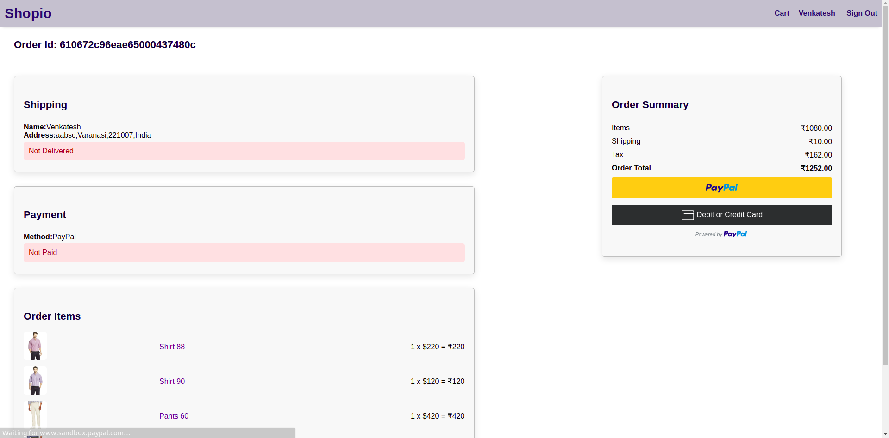
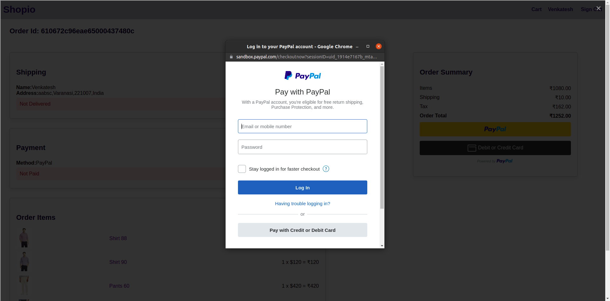
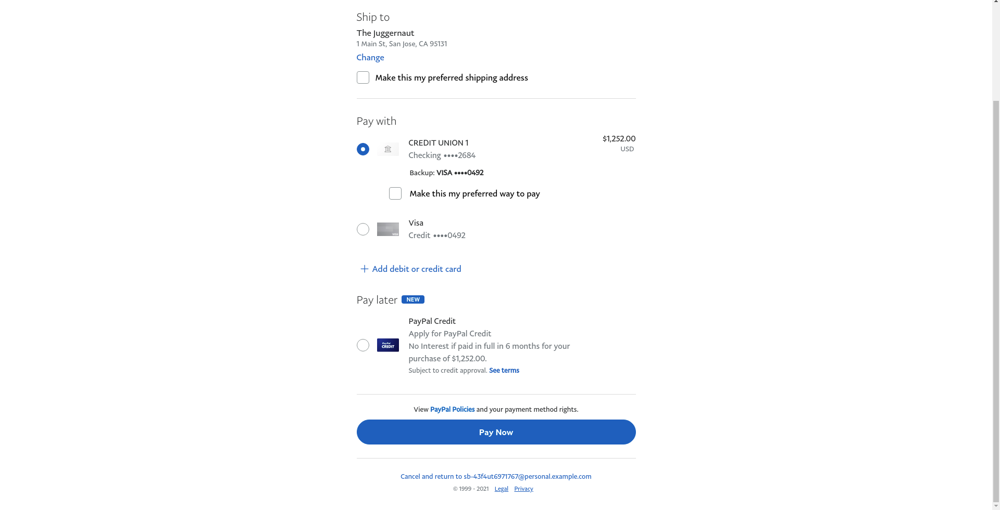

